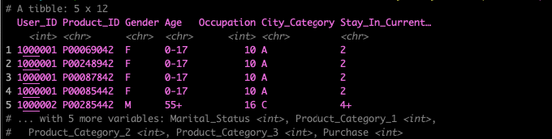
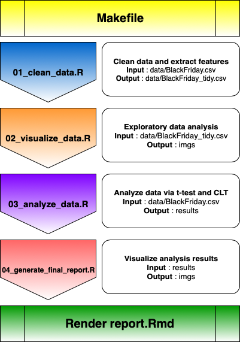

# Black Friday Purchases Analysis

# Team

Instructor : Tiffany Timbers

Teaching Assistant : Ali Mirza

| Name  | Slack Handle | Github.com | Link |
| :------: | :---: | :----------: | :---: |
| Gilbert Lei | `@Gilbert Lei` | `@gilbertlei` | [Gilbert's link](https://github.ubc.ca/mds-2018-19/DSCI_522_proposal_junxiong)|
| Mengda Yu | `@Mengda(Albert) Yu` | `@mru4913` | [Albert's link](https://github.com/mru4913/DSCI_522_BlackFriday_Analysis) |

# Overview

This project is to analyze whether male and female make the same amount of purchase on Black Friday via a hypothesis test on a data set that contains the transactions made in a retail store on a Black Friday.

It follows the data analysis methodology shown below.  

<div align="middle">
  
  <p><em>R for Data Science by Grolemund & Wickham</em>
  <a href="https://r4ds.had.co.nz/introduction.html"> source</a>
  </p>
</div>

A specific inferential question to be addressed by this project:


> Is the amount of purchase made by male different from that made by female on Black Friday?


In this project, we defined our null hypothesis and alternative hypothesis.

- Null hypothesis: The mean purchase amount made by male is not different from the mean purchase amount made by female.
- Alternative hypothesis: The mean purchase amount made by male is different from the mean purchase amount made by female.

We wrote R scripts to clean, visualize and analyze the data set. Then we produced a final report with the decision based on the asymptotic theory and a t-test. The p-value calculated via the t-test is significantly less than the threshold 0.05, which indicates strong evidence against the null hypothesis. Thus, we rejected the null hypothesis.

This project repository includes data, scripts, documents and results.

# Data Source

The data set we used for this project is [BlackFriday.csv](https://www.kaggle.com/mehdidag/black-friday)(5 MB), which contains over 500,000 observations about the Black Friday sales in a retail store. It involves different kinds of numerical variables, such as `purchase`, and categorical variables, such as `gender`. This dataset is originally used by people to gain a better understanding of customer purchase behaviour.

##### Acknowledgments

The data set is downloaded from Kaggle.com ([download link](https://www.kaggle.com/mehdidag/black-friday)). It
originally comes from a competition hosted by `Analytics Vidhya`.

---
To read the first 5 lines from `BlackFriday.csv`, we run the following script in R. The output is shown in below image.

```
Rscript src/00_read_raw_data.R data/BlackFriday.csv 5
```

<div align="middle">
  
</div>

# Usage

The data analysis in this project comprises of 5 steps, including cleaning data, visualizing data, analyzing data, generating results and generating a final report, as shown below.

<div align="middle">
  
</div>


We started with cleaning data via R script `01_clean_data.R`, which takes two arguments, a file path that points to the raw data and another file path that specifies where to store the output from the script. Then we performed exploratory data analysis via R script `02_visualize_data.R`. This script loads the tidy data generated by the first script and generates a group of figures to show any patterns in the data set. In the third R script `03_analyze_data.R`, we based on the asymptotic theory to calculate sampling estimates and run t-test. The results were stored in csv files in `results` folder. After that, we used `04_generate_final_result.R` to visualize these results and save these figures in `imgs` folder. In the end, we created a R Markdown file `report.Rmd` which includes all information mentioned above and is rendered into a final report in .md format in `doc` folder.

We use `Make` to automate our data analysis scripts. The `Makefile` in project root directory contains the execution of the Rscripts. To reproduce our data analysis, you need to install `Make` with the command `xcode-select --install`.

Then, you can clone the repository from `Github.com` to your local computer.
```
git clone https://github.com/UBC-MDS/DSCI_522_BlackFriday_Purchases_Analysis.git
```

Finally, you can start a Command Prompt/Terminal, navigate to the `root` of the project directory and run the following commands step by step.
```
# step 1 - clean data and generate tidy data set
make data/BlackFriday_tidy.csv

# step 2 - run exploratory data analysis and save three plots
make imgs/gender_bar.png imgs/purch_dist.png imgs/gender_pur_hist.png

# step 3 - run CLT-based estimation and hypothesis test,
# save analysis results into two csv files
make results/blackfriday_est.csv results/t_test_result.csv

# step 4 - make plots to visualize analysis results
make imgs/errorbar.png imgs/tdist.png

# step 5 - Render R Markdown file to generate project report
make doc/report.md
```

Or, you can simply run one single command, which automatically goes through the five steps mentioned above.

```
# generate all outputs
make all
```

If, after you have finished some or all of the steps, you want to re-run the analysis, you can execute the command below to remove the files generated by any or all of the scripts. Then you can repeat the steps above. 
```
# clean all outputs
make clean
```

# Dependencies

- R (version 3.5.1)
- R libraries
  - tidyverse (version 1.2.1), *manipulate and organize dataset*
  - ggplot2 (version 3.1.0), *generate graphics*
  - scales (version 1.0.0), *scale tools for graphics*
  - broom (version 0.5.0), *tidy table appeareance*
