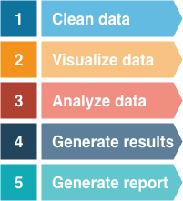

# Project: Black Friday Analysis

# Overview

The project is to analyze whether male and female make the same amount of purchase on Black Friday via a hypothesis test. 

It follows the data analysis methodology shown below.  

<center> </center>
<center><i>Source: [R for Data Science](https://r4ds.had.co.nz/introduction.html) by Grolemund & Wickham</i></center>

This project includes data, scripts, documents and results.

# Team

__Instructor__ : Tiffany Timbers

__Teaching Assistant__ : Ali Mirza

| Name  | Slack Handle | Github.com | Link |
| :------: | :---: | :----------: | :---: |
| Gilbert Lei | `@Gilbert Lei` | `@gilbertlei` | [Gilbert's link](https://github.ubc.ca/mds-2018-19/DSCI_522_proposal_junxiong)|
| Mengda Yu | `@Mengda(Albert) Yu` | `@mru4913` | [Albert's link](https://github.com/mru4913/DSCI_522_BlackFriday_Analysis) |

# Data Source

The data set we use for this project is [BlackFriday.csv](https://www.kaggle.com/mehdidag/black-friday)(5 MB), which contains over 500 000 observations about the Black Friday in a retail store. It involves different kinds of numerical variables, such as `purchase`, and categorical variables, such as `gender`. This dataset is originally used for people to make a better understanding of customer purchase behaviour.

##### Acknowledgements

The data set is downloaded from Kaggle.com ([download link](https://www.kaggle.com/mehdidag/black-friday)). It
originally comes from a competition hosted by `Analytics Vidhya`.

---
To read first 5 lines from `BlackFriday.csv`, we run the following script in R.

```r
Rscript src/00_read_raw_data.R data/BlackFriday.csv 5
```


### Dependencies

- R version 3.5.1
- tidyverse, *manipulate and organize dataset*
- ggplot2, *generate graphics*
- scales, *scale tools for graphics*
- broom, *tidy dataset*

# Project Objective

The data set contains the transactions made in a retail store on the Black Friday. We want to understand better the difference of the purchase behaviour between male and female. An inferential question to be addressed by this project:

Is the amount of purchase made by male different than that made by female during Black Friday?

# Analysis Plan

The data set contains 12 columns or features. Two main features are useful in our project. One is `purchase`, which is quantitive and represents the purchase amount in dollars, and another is `gender`, which is categorical and has two possible values: male (M) and female (F).

To answer the question, we will follow the standard hypothesis test process.

1. We will define our null and alternative hypotheses.
  - Null hypothesis $H_0$: The mean purchase amount made by male is not different than the mean purchase amount made by female.
  - Alternative hypothesis $H_1$: The mean purchase amount made by male is different than the mean purchase amount made by female.
2. We will compute a t-statistic that corresponds to the null hypothesis.
3. We will create a model of null hypothesis and plot a t-distribution, with degrees of freedom equal to the Welch approximation to the degrees of freedom.
4. We will observe where our statistic falls on this distribution and calculate a p-value.
5. Depends on the observation and the p-value, we will interpret the test and make a conclusion on whether to reject the null hypothesis or not. If the p-value is less than 0.05, then we will reject the null hypothesis. Otherwise we will fail to reject the null hypothesis. With that, we will know whether male and female spent the same amount on Black Friday.  

To assist our hypothesis test, we will also use the Central Limit Theorem to calculate the mean purchase amount of male and female with 95% confidence intervals. Next we will look into whether there is an overlap between the 95% confidence intervals of these two samples and draw a conclusion.

# Summary Presentation

A summary statement regarding the results of this project will include the following:

- A table to summarize the means and 95% confidence intervals of male and female purchases on Black Friday.  
- An error bar plot to show the 95% confidence intervals obtained from the two bootstrapping distributions.  
- A distribution plot to show the distribution of the null hypothesis, with vertical lines to represent 95% confidence interval and t-statistic.  

We will also comment on what we observe and make a conclusion on the results of our analysis.

# Procedure

The procedure of running data analysis contains 5 steps, including clearning data, visualizing data, analyzing data, generating results and generating a final report, as shown below.



We start with cleaning data via `01_clean_data.R` that takes two arguments, a file that contains raw data and a output file that contains a tidy version of data. Then we apply exploratory data analysis via `02_visualize_data.R` from the tidy version of data file to discover patterns and generate a group of figures with the given path prefix `imgs`. In `03_analyze_data.R`, we carry out estimation and t-test based on the Central Limit Theorem and asymptotic theory. The results are stored in `results` folder. Then we generate final figures from the last step via `04_generate_final_result.R` and save them in `imgs`. In the end, we render `report.Rmd` into a Markdown file.

```r
# step 1 clean data
Rscript src/01_clean_data.R data/BlackFriday.csv data/BlackFriday_tidy.csv

# step 2 visualize data via EDA
Rscript src/02_visualize_data.R data/BlackFriday_tidy.csv imgs

# step 3 analyze data via t-test and CLT
Rscript src/03_analyze_data.R data/BlackFriday_tidy.csv results

# step 4 generate final results
Rscript src/04_generate_final_result.R results imgs

# step 5 Render Markdown file 
Rscript -e "rmarkdown::render('./doc/report.Rmd')"
```