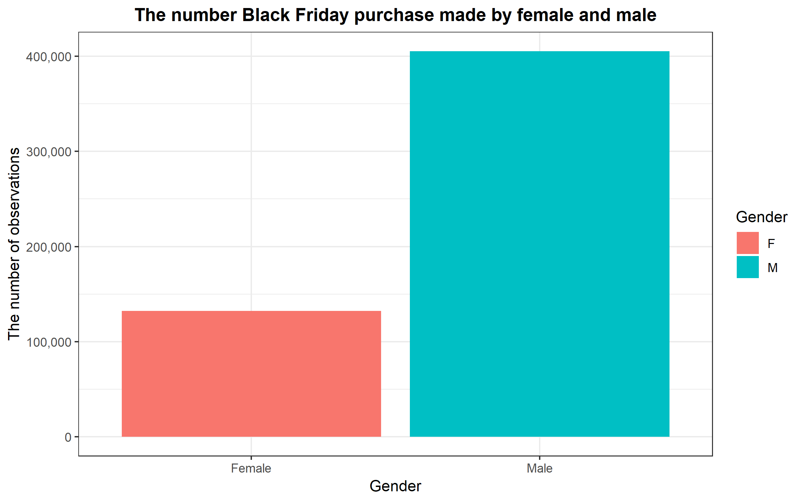
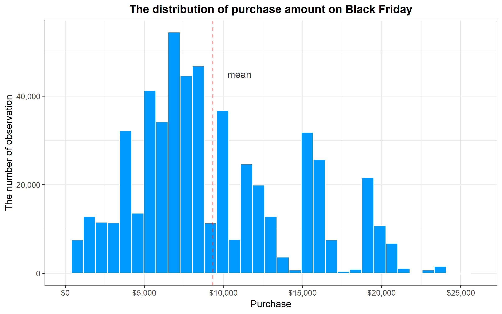
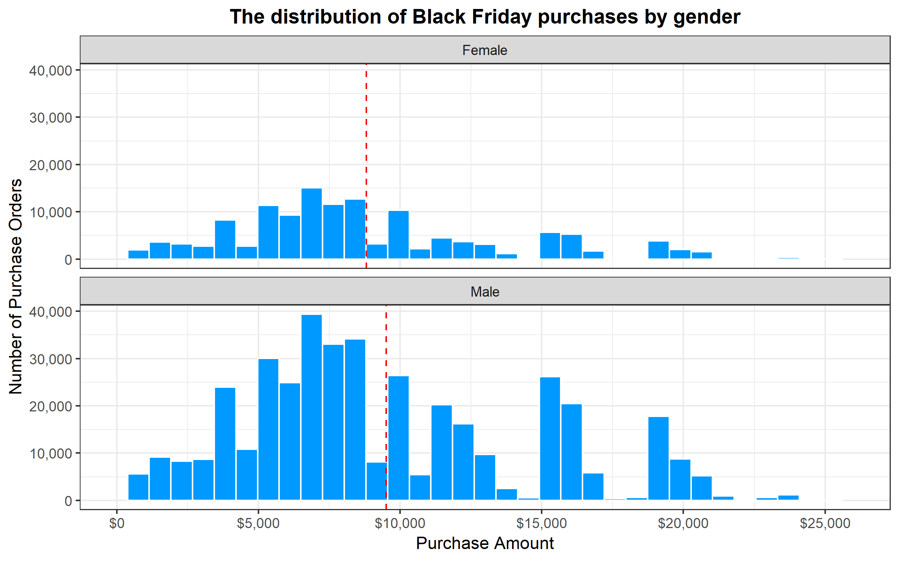
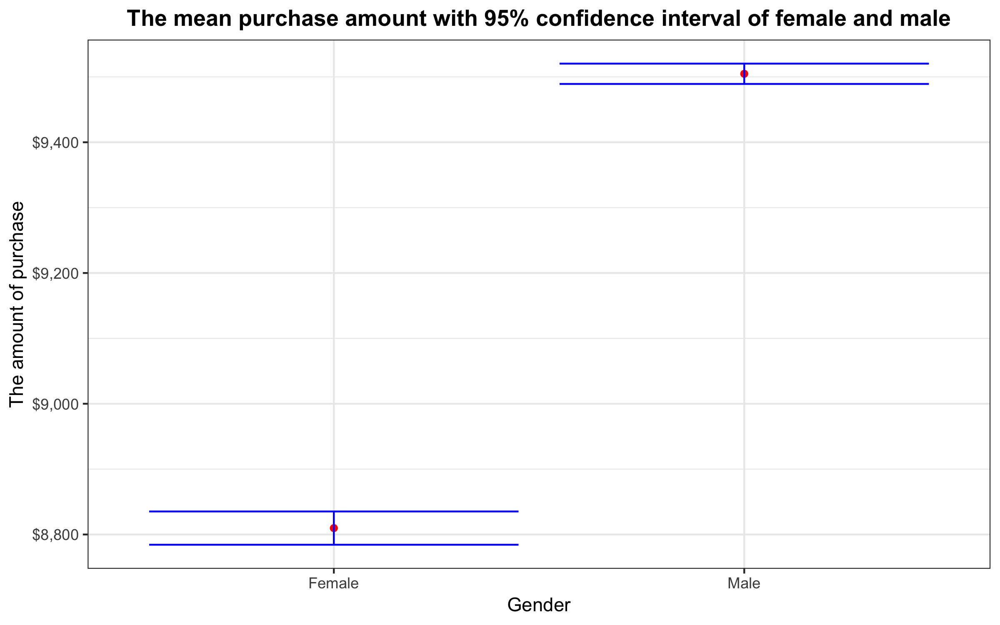
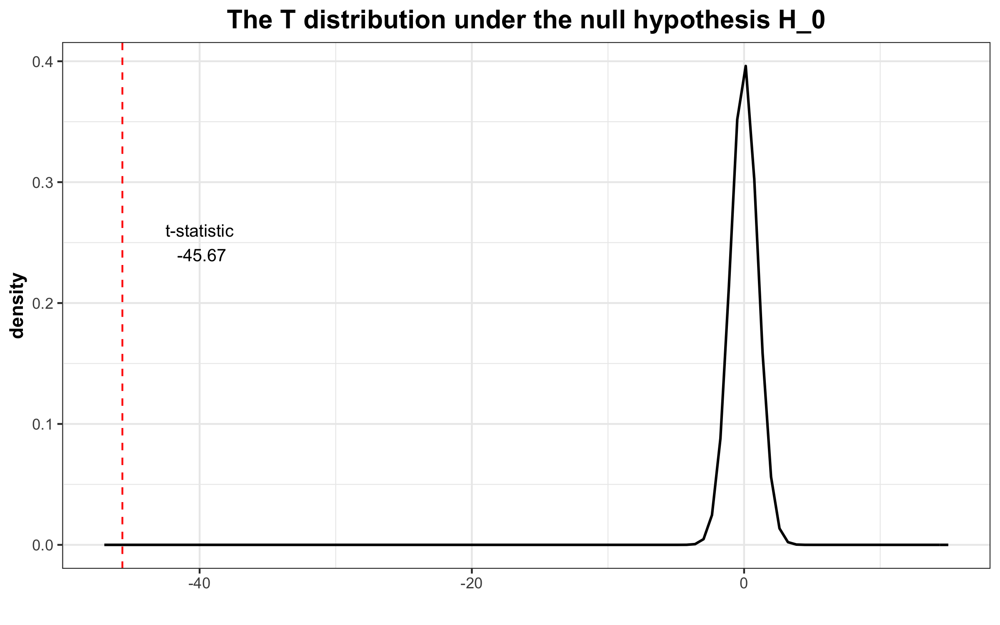

Black Friday Purchases Analysis
================
Gilbert Lei and Mengda (Albert) Yu
2018/11/22

# 1.0 Introduction

Black Friday is a name given to the shopping day after Thanksgiving.
Many people go out to shop and spend a large amount of money. People
might be curious about how male’s purchase behavior on Black Friday
differs from that of female. One specific question to ask is whether
male and female spend the same amount on Black Friday. In this project,
we will apply data analysis techniques to find an answer to this
question.

# 2.0 Data Set

The data set used in this project contains the transactions made in a
retail store on Black Friday. It contains 12
features.

| User\_ID | Product\_ID | Gender | Age  | Occupation | City\_Category | Stay\_In\_Current\_City\_Years | Marital\_Status | Product\_Category\_1 | Product\_Category\_2 | Product\_Category\_3 | Purchase |
| -------: | :---------- | :----- | :--- | ---------: | :------------- | :----------------------------- | --------------: | -------------------: | -------------------: | -------------------: | -------: |
|  1000001 | P00069042   | F      | 0-17 |         10 | A              | 2                              |               0 |                    3 |                   NA |                   NA |     8370 |
|  1000001 | P00248942   | F      | 0-17 |         10 | A              | 2                              |               0 |                    1 |                    6 |                   14 |    15200 |
|  1000001 | P00087842   | F      | 0-17 |         10 | A              | 2                              |               0 |                   12 |                   NA |                   NA |     1422 |
|  1000001 | P00085442   | F      | 0-17 |         10 | A              | 2                              |               0 |                   12 |                   14 |                   NA |     1057 |
|  1000002 | P00285442   | M      | 55+  |         16 | C              | 4+                             |               0 |                    8 |                   NA |                   NA |     7969 |

*Table 1. Black Friday raw data that contains 12 features.*

To perform our hypothesis test, we used two features from the data set.
One is `Purchase`, which is quantitative and represents the purchase
amount in dollars, and another is `Gender`, which is categorical and has
two possible values: M (male) and F (female).

| Gender | Purchase |
| :----- | -------: |
| F      |     8370 |
| F      |    15200 |
| F      |     1422 |
| F      |     1057 |
| M      |     7969 |

*Table 2. A tidy version of Black Friday data used in the porject. It
contains two variables, Purchase (quantitative) and Gender
(categorical).*

# 3.0 Exploratory Data Analysis

We firstly did some preliminary investigations to understand the data
and discover possible patterns.

We made a bar plot to show the numbers of purchases made by male and
female respectively. As can be seen below, there are around 13,000
purchased made by female; whereas male made more than 400,000 purchases,
three times the number of purchases made by female.

*Figure 1. The number of female and male made purchases on Black Friday.
The number of male made purchase on BlackFriday is greater than that of
female.*

A histogram we plotted, shown in below, reveals that the amount of the
majority purchases made on Black Friday are centralized in a range from
about $5,000 to $13,000. The mean purchase amount is around $10,000.

*Figure 2. The distribution of all purchases made on Black Friday. The
red vertical line represents the mean purchases amount on Black Friday.*

We also made separate histogram plots for purchases made by male and
female. As we can see from these plots, shown below, the shapes of the
distributions of purchases made by female and male are quite similar. In
addition, the difference between the means of the two groups looks quite
small on the chart. Does this imply that male and female spent the same
amount on Black Friday? Let’s find out in our formal analysis.

*Figure 3. The distribution of purchases made by male and female on
Black Friday. The red vertical lines represent the mean purchases amount
for each gender.*

# 4.0 Analysis

The process of our analysis begins with the definition of null
hypothesis and alternative hypothesis. The null hypothesis \(H_0\) is
the mean purchase amount made by male is not different from the mean
purchase amount made by female, while the alternative hypothesis \(H_A\)
is the mean purchase amount made by male is different than the mean
purchase amount made by female.

### 4.1 Estimation

We use the Central Limit Theorem (CLT) to calculate the standard error
(SE) of the sample statistic of interest in order to estimate the mean
of the population. The standard error is the standard deviation of the
sampling distribution, which can be calculated by the following.

> SE = s/sqrt(n)

where \(s\) is the sample standard deviation and \(n\) is the number of
observations in the sample.

We then apply a mathematical short cut to calculate the 95% confidence
intervals around the sample mean. This is the plausible range for the
true population mean we are estimating.

> 95% confidence interval = point estimate +/- z \* SE

The multipliers (\(z\)) for the 95% confidence interval formula is the
quantiles of 2.5% and 97.5%. The results are summarized
below.

| X1 | Gender | purchase\_mean |      n |       se | lower\_95 | upper\_95 |
| -: | :----- | -------------: | -----: | -------: | --------: | --------: |
|  1 | F      |       8809.761 | 132197 | 12.98565 |  8784.310 |  8835.213 |
|  2 | M      |       9504.772 | 405380 |  7.93325 |  9489.223 |  9520.321 |

*Table 3. The mean purchase amount with 95% confidence interval. It
contains the mean, the number of observation and the 95% confidence
interval for each gender.*

Next we plot the mean and 95% confidence interval for each purchase
group in an error bar plot.

*Figure 4. The mean purcahse amount with 95% confidence interval of
female and male. The red points represent the mean purchase amount. The
error bars represent the 95% confidence interval around the mean.*

The estimate for the population mean of purchases made by female is
8809.761 with a 95% confidence interval of (8784.310, 8835.213). The
estimate for the population mean of purchases made by male is 9504.772
with a 95% confidence interval of (9489.223, 9520.321). It should be
noticed that there is no overlap between the 95% confidence intervals of
the two groups. Actually, they are completely separated from each other.
Therefore, we might reject the null hypothesis.

### 4.2 Hypothesis Test

We applied t-test to further investigate on whether the mean purchases
are not different. The results of t-test are shown
below.

| X1 |   estimate | estimate1 | estimate2 |  statistic | p.value | parameter |   conf.low | conf.high | method                  | alternative |
| -: | ---------: | --------: | --------: | ---------: | ------: | --------: | ---------: | --------: | :---------------------- | :---------- |
|  1 | \-695.0104 |  8809.761 |  9504.772 | \-45.67265 |       0 |  238457.3 | \-724.8357 | \-665.185 | Welch Two Sample t-test | two.sided   |

*Table 4. The result of t-test.*

The t-statistic and the degree of freedom are -45.67 and 238457
respectively. We use them to plot a t-distribution. Since the sample
size is large, the t-distribution is very close to a normal
distribution.

*Figure 5. The t-distribution with t-statistic. The bule dashed lines
are the 95% confidence interval of a t-distribution. The red line
represent the t-statistic.*

The above plot shows that the t-statistic falls far out of the 95%
confidence interval. The corresponding p-value is approximately 0, which
is far less than the threshold of 0.05 and is a strong evidence against
the null hypothesis. Therefore, we reject the null hypothesis.

### 4.3 Conclusion

As discussed above, both the asymptotic theory-based analysis and t-test
show that we should reject the null hypothesis. Thus we reject the null
hypothesis and conclude that the amounts male and female spent on Black
Friday are different.

# 5.0 Assumptions

In this project, we base our statistical inference on asymptotic theory.
It means we assume the sample used in this project meets the two
important conditions of the CLT.

Firstly, the sample is independent. To meet the independence condition,
we consider two things.  
1\. The sample is random. As mentioned above, the data points in the
data set come from the Black Friday sales records in a store. We assume
this store is a typical store in the United States and all the purchases
made on Black Friday at this store is not significantly different from
the purchases made at any other stores on Black Fridays.  
2\. The sample size is less than 10% of the population size. Since the
sample contains only the sales data from one store in the United States,
it must be less than 10% of all the Black Friday sales in the United
States.

Secondly, the sample size is big enough. Since the sample contains more
than 500,000 data points, we believe it is a big enough sample.

# 6.0 Limitations and Future Directions

Due to time constraint, we choose to work on one single data set that is
readily downloadable from Kaggle.com. We also limit our analysis on the
means of male and female purchases. If we have more time to work on this
project in the future, we believe we could improve our analysis in
several aspects.

Firstly, we should improve the randomness of the sample. Our current
sample includes only sales records from one store. It is prone to be
biased. One way to improve that is to randomly select purchase records
from different stores at different regions.

Secondly, after answering the question on whether male and female spent
the same amounts on Black Friday, we may further analyze what male and
female really bought, so as to get deeper insight into the different
purchase behaviors between male and female.

# 7.0 References

1.  *Black Friday analysis, Kaggle.com*. \[online\] Available at:
    <https://www.kaggle.com/mehdidag/black-friday>. \[Accessed 23
    Nov. 2018\]

2.  *R for Data Science, by Grolemund & Wickham*. \[online\] Available
    at: <https://r4ds.had.co.nz/introduction.html>. \[Accessed 23
    Nov. 2018\]

3.  *Introduction to asymptotic theory*. \[online\] Available
    at:<https://github.ubc.ca/MDS-2018-19/DSCI_552_stat-inf-1_students/blob/master/lectures/06_lecture-intro-to-asymptotic-theory.ipynb>.
    \[Accessed 23 Nov. 2018\]
